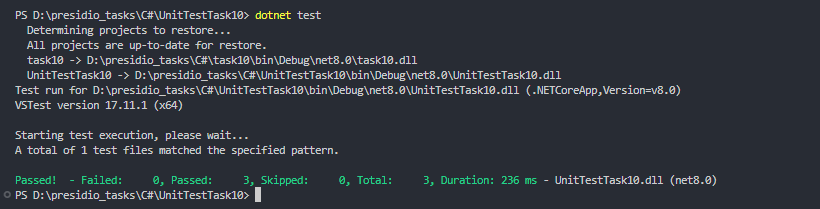

# Task 10: Unit Testing for Mini Microservice - Task 10

### 🎯Objective :

- This section focuses on writing unit tests for the BooksController in the Mini Microservice project, ensuring that the API's behavior is tested correctly using xUnit and an in-memory database for isolated testing.


###  ✅ Unit Test Setup:


#### 1️⃣ Testing Framework

- xUnit is used as the testing framework to create unit tests for the controller and service layers.


#### 2️⃣ In-memory Database

- We use InMemoryDatabase from Entity Framework Core to mock the database layer, allowing us to run tests without requiring an actual database connection.


#### 3️⃣ Mocking Services

- AutoMapper is used to map entities and DTOs.

- ILogger is injected to ensure that logging is available during the test execution.


### 📝 Test Class

#### 1️⃣ BooksControllerTest Class:

- Initializes the controller and database context, providing the necessary mocks (logger, mapper, etc.).

#### 2️⃣ Test Methods:

- `GetBooksTest`: Verifies that the GetBooks action returns a successful response with a 200 OK status code.

- `CreateBooksTest`: Verifies that creating a new book returns a successful response.

- `GetByIdTest`: Tests both a successful book fetch and a scenario where the book is not found, checking the correct status codes (`200` and `500`).

 
### 🛠 Code

```

namespace UnitTestTask10;

using AutoMapper;
using Microsoft.AspNetCore.Mvc;
using Microsoft.EntityFrameworkCore;
using Microsoft.Extensions.Logging;
using task10.AppDataContext;
using task10.Contarcts;
using task10.Controller;
using task10.Mappings;
using task10.Services;

public class BooksControllerTest
{

    private readonly BooksController _bookController;
    private readonly ApplicationDbContext _context;

    public BooksControllerTest()
    {
        var db = new DbContextOptionsBuilder<ApplicationDbContext>()
            .UseInMemoryDatabase(databaseName: "testdb")
            .Options;

        _context = new ApplicationDbContext(db);

        var logger = new LoggerFactory().CreateLogger<BookService>();

        var mapper = new MapperConfiguration(config =>
        {
            config.AddProfile<MappingProfile>();
        }).CreateMapper();

        var Bookservice = new BookService(_context, logger, mapper);

        _bookController = new BooksController(Bookservice);

    }

    [Fact]
    public async Task GetBooksTest()
    {
        var result = await _bookController.GetBooks();

        var okResult = Assert.IsType<OkObjectResult>(result);
        Assert.Equal(200, okResult.StatusCode);
    }


    [Fact]
    public async Task CreateBooksTest()
    {
        var book = new CreateBooks
        {
            Name = "Sample Book",
            Author = "Sample author",
            Price = 1234.5,
            IsCompleted = false
        };

        var result = await _bookController.CreateBooks(book);

        var okResult = Assert.IsType<OkObjectResult>(result);
        Assert.Equal(200, okResult.StatusCode);
    }

    [Fact]
    public async Task GetByIdTest()
    {

        var result = await _bookController.GetById(1);
        var notFoundResult = await _bookController.GetById(2);

        // Then
        var okResult = Assert.IsType<OkObjectResult>(result);
        var notOkResult = Assert.IsType<ObjectResult>(notFoundResult);

        Assert.Equal(200, okResult.StatusCode);
        Assert.Equal(1, _context.Books.Count());

        Assert.Equal(500, notOkResult.StatusCode);

    }

}

```
### 📌 Output

