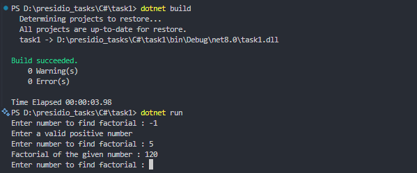

# Task 1: Basic Data Types, Control Structures, and Methods


### 🎯Objective :

- Develop a console application that calculates the factorial of a given number while ensuring input validation and using appropriate control structures.


###  ✅  Requirements :

- Prompt the user to enter an integer.
- Validate the input to ensure it’s a positive integer.
- Use either loops or recursion to compute the factorial.
- Display the calculated factorial in the console.

###  🛠 Implementation Steps


#### 1️⃣ Read and Validate Input

- Read the input from the user
- Ensure its is a valid number
- Convert the input string to int

#### 2️⃣ Factorial Calculation

- Create a function for Factorial
- Either using lopps or recursion find the factorial of the given number

#### 3️⃣ Output the Result

- Display the calculated result

### 📝 Code
```
namespace Task1
{
    class Task
    {
        static int FactotialFunc(int num)
        {
            int result = 1;
            for (int i = num; i > 0; i--)
            {
                result *= i;
            }
            return result;
        }

        static void Main(string[] args)
        {
            while (true)
            {
                Console.Write("Enter number to find factorial : ");
                int number = Convert.ToInt32(Console.ReadLine());
                if(number <= 0){
                    Console.WriteLine("Enter a valid positive number");
                    continue;
                }
                Console.WriteLine("Factorial of the given number : {0}", FactotialFunc(number));
            }
        }

    }
}
```

### 🔹 Alternative Approach

- Using Recursion instead of loop.
```
static int FactotialFunc(int num)
{
    if(num == 0){
        return 1;
    }else{
        return num * FactotialFunc(num-1);
    }
}
```

### 📌 Output
