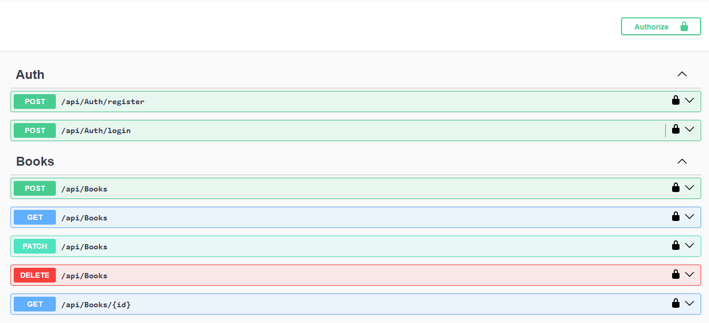
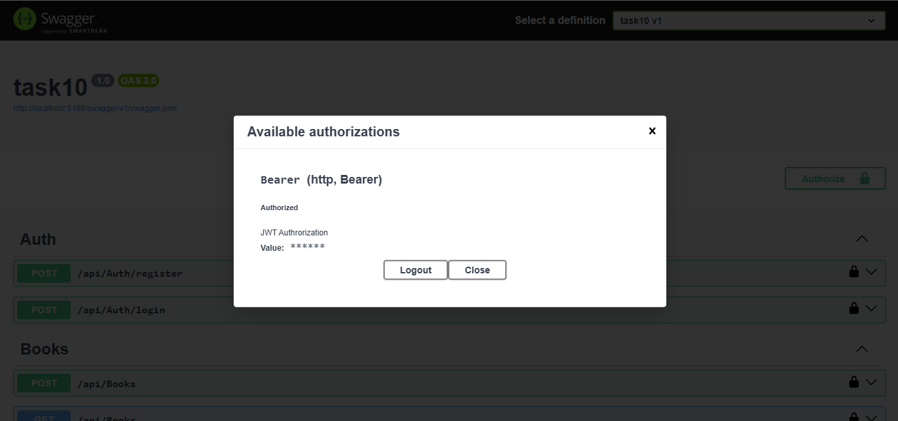
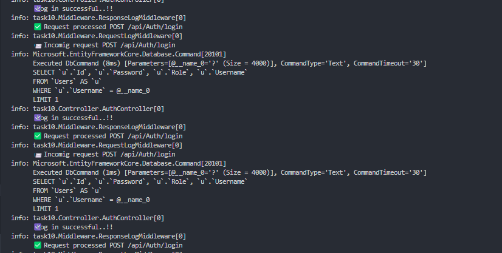

# Task 10: Building a Mini Microservice with ASP.NET Core

### 🎯Objective :

- Develop a lightweight, modular RESTful API that manages a specific resource (Books) using best practices in ASP.NET Core, including dependency injection, asynchronous programming, and clean architecture principles.


###  ✅  Requirements :

#### 🧱 Project Setup

- Create a new ASP.NET Core Web API project:
```
dotnet new webapi -n projectName
```

#### 🔨 Create MVC Setup

- Create a Book Repository Interface
- Create a Book Service that implements this Interface
- Create a controller that access Book service


#### 🔄 Dependency Injection

- Define interfaces and service that implements to enable dependency injection

```
builder.Services.AddScoped<IBookRepository, BookService>();
builder.Services.AddScoped<IUserRepository, UserService>();

```

#### 🗂️ Data Access

- Use `Entity Framework Core` for sql database connection.
- Define Db context for connecting to database

```
builder.Services.AddDbContext<ApplicationDbContext>(options =>
    options.UseMySql(conn,
    new MySqlServerVersion(new Version(8, 0, 34)))
);
```

#### 🔗 DTO Contracts and Mappings

- Create Data Transfer Object and map it to the API request handlers for validation and map objects from one type to another.

```
public class MappingProfile : Profile
{
    public MappingProfile()
    {
        CreateMap<CreateBooks, Book>();

        CreateMap<UpdateBooks, Book>();
        
        CreateMap<CreateUser, User>();
    }
}

```

#### ⚙️ Asynchronous Operations

- Use `async/await` in all data-access and controller methods to ensure responsiveness.

```
public async Task<List<Book>> GetAllBooks()
{
    try
    {
        var books = await _context.Books.ToListAsync();
        if (books == null)
        {
            throw new Exception("No Books found");
        }
        return books;
    }
    catch (System.Exception)
    {
        throw new Exception("Error while retreving");
    }
}
```

#### 🛡 Error Handling & Logging

- Add global exception handling via middleware.
- Configure logging middlewares while receiving request and response

```
builder.Services.AddExceptionHandler<GlobalExceptionHandler>();

app.UseMiddleware<RequestLogMiddleware>();
app.UseMiddleware<ResponseLogMiddleware>();

app.UseExceptionHandler();
```

#### 🔑 Authentication & Authorization

- Created JWT token authentication.
- Implemented Role based authorization for accessing sensitive routes.

```
[Authorize(Roles = "Admin")]
[HttpDelete]
public async Task<IActionResult> DeleteBooks(int id)
{
    try
    {
        await _bookRepo.Delete(id);
        return Ok(new { Message = "Deleted successfully" });
    }
    catch (System.Exception ex)
    {
        return StatusCode(500, new { Message = $"{ex.Message} Error during deletion" });

        throw;
    }
}

builder.Services.AddAuthorization();

app.UseAuthentication();
app.UseAuthorization();
```

### 📌 Output







