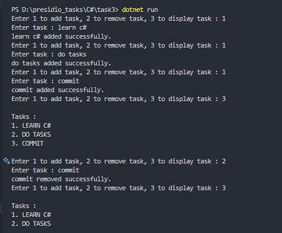

# Task 3: Basic Collections and String Manipulation


### 🎯Objective :

- Develop a console application to manage a list of strings, allowing users to add, remove, and display items while utilizing essential string manipulation techniques.


###  ✅  Requirements :

- Maintain a collection of items using `List<string>`.
- Provide user options to:
    - Add new items to the list.
    - Remove specific items.
    - Display all items in the list.
- Utilize string methods like `Trim()`, `ToUpper()`, etc., for input processing.
- Use loops for iterating through the list and managing user interactions.


###  🛠 Implementation Steps


#### 1️⃣ Define a Class with List and functions

- Create `List<string>`.
- Create functions like `Add`, `Remove` and `Display`.

#### 2️⃣ Initialize, Create Menu and Get User Input.

- In the main method, create instance of the `ToDoList` class.
- Create a menu for user to interact with list.
- Get user input and process it.

#### 3️⃣ Display Menu and Make User interact.

- Make user interact with list.
- Display the list.

### 📝 Code

```
using System;

namespace Task3
{
    class ToDoList
    {
        private List<string> list = new List<string>();

        public void AddTask(string task)
        {
            if (task == null || task == "")
            {
                Console.WriteLine("Enter a valid task.");
                return;
            }
            list.Add(task.ToUpper());
            Console.WriteLine($"{task} added successfully.");
        }

        public void RemoveTask(string task)
        {
            if (task == null || task == "")
            {
                Console.WriteLine("Enter a valid task.");
                return;
            }

            for (int i = 0; i < list.Count; i++)
            {
                if (list[i] == task.ToUpper())
                {
                    list.RemoveAt(i);
                    Console.WriteLine($"{task} removed successfully.");
                }
            }
        }

        public void DisplayTask()
        {

            Console.WriteLine("\nTasks : ");
            int i = 1;
            foreach (var task in list)
            {
                Console.WriteLine($"{i++}. {task}");
            }
            Console.WriteLine();
        }

    }
    class Task
    {
        static void Main(string[] args)
        {
            ToDoList list = new ToDoList();

            while (true)
            {
                Console.Write("Enter 1 to add task, 2 to remove task, 3 to display task : ");
                string option = Console.ReadLine() ?? "";
                switch (option)
                {
                    case "1":
                        Console.Write("Enter task : ");
                        string addtask = Console.ReadLine() ?? "";
                        list.AddTask(addtask);
                        break;
                    case "2":
                        Console.Write("Enter task : ");
                        string removetask = Console.ReadLine() ?? "";
                        list.RemoveTask(removetask);
                        break;
                    case "3":
                        list.DisplayTask();
                        break;
                    default:
                        Console.WriteLine("Enter a valid option");
                        break;
                }
            }
        }
    }
}
```

### 📌 Output

