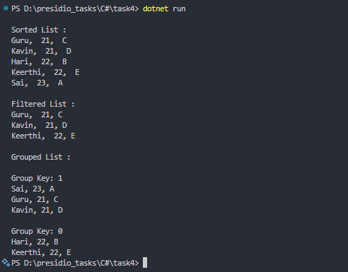

# Task 4: Working with Collections and LINQ


### 🎯Objective :

- Develop a student management console application that utilizes collections and LINQ to filter and sort student data efficiently.


###  ✅  Requirements :

- Create a `Student` class with properties:
    - `Name` (string)
    - `Age` (int)
    - `Grade` (string)
- Create a list (`List<Student>`) with sample student data.
- Use **LINQ** :
    - To filter students based on Grade
    - To sort students based on age
- Display the result.


###  🛠 Implementation Steps


#### 1️⃣ Define the Student Class

- Create a class with properties (Name, Grade, Age).
- Write constructor to initialize tha object.

#### 2️⃣ Initialize and Populate a Collection.

- Use `List<Student>` to store sample student data.

#### 3️⃣ Apply LINQ Queries

- Filter students based on `Grade`.
- Sort students based on `Age`.
- Additionally grouped students based on `Age` even or odd.

### 📝 Code

```
using System;

namespace Task4
{
    class Student
    {
        public Student(string name, int age, string grade)
        {
            Name = name;
            Age = age;
            Grade = grade;
        }
        public string Name
        {
            get; set;
        }

        public int Age
        {
            get; set;
        }

        public string Grade
        {
            get; set;
        }

    }
    class Task
    {
        static void Main(string[] args)
        {
            List<Student> students = new List<Student>();

            students.Add(new Student("Sai", 23, "A"));
            students.Add(new Student("Hari", 22, "B"));
            students.Add(new Student("Guru", 21, "C"));
            students.Add(new Student("Kavin", 21, "D"));
            students.Add(new Student("Keerthi", 22, "E"));

            var filteredList = from student in students
                               where string.Compare(student.Grade, "B") > 0
                               select student;

            var sortedList = students.OrderBy(student => student.Age);

            var groupedList = students.GroupBy(student => student.Age % 2);

            Console.WriteLine($"\nSorted List : ");

            foreach (var student in sortedList)
            {
                Console.WriteLine($"{student.Name},  {student.Age},  {student.Grade}");
            }

            Console.WriteLine($"\nFiltered List : ");

            foreach (var student in filteredList)
            {
                Console.WriteLine($"{student.Name},  {student.Age}, {student.Grade}");

            }

            Console.WriteLine($"\nGrouped List : ");

            foreach (var group in groupedList)
            {
                Console.WriteLine($"\nGroup Key: {group.Key}");
                foreach (var student in group)
                {
                    Console.WriteLine($"{student.Name}, {student.Age}, {student.Grade}");
                }
            }
        }
    }
}

```

### 📌 Output

