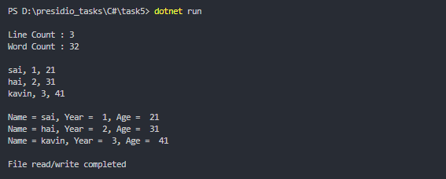

# Task 5: File I/O and Exception Handling


### 🎯Objective :

- Develop an application that reads data from a file, processes it, and writes the result to another file, while handling potential file-related exceptions.


###  ✅  Requirements :

- Read text from a file (Simple CSV).
- Process the data
    - Line count
    - Words count
    - Format to text format using LINQ
- Write the results to a new file.
- Handle exceptions (`FileNotFoundException`, `IOException`)


###  🛠 Implementation Steps


#### 1️⃣ Reading from a File

- Open a file and read all lines using `File.ReadAllLines(pathname)` from System.IO namespace.
- If file not available, I created a dummu csv file.

#### 2️⃣ Processing Data

- Count number of lines using `array.Length`
- Count number of words also using `string.Length`
- Use LINQ to process the data from csv format to text format.

#### 3️⃣  Writing to a New File

- Write the processed data into the new text file using `File.WriteAllLines(pathname, string[])`

#### 4️⃣ Implementing Exception Handling

- Using `try-catch` block catch FileNotFoundException and IOException and handle it.
- If exceptions are not handled programs wont be running normally, it will be terminated if any unhandled exceptions arise.

### 📝 Code

```
using System;
using System.IO;

namespace Task5
{
    class Task
    {
        static void Main(string[] args)
        {
            try
            {
                if (!File.Exists(@"./data.csv"))
                {
                    List<string> users = new List<string>()
                {
                    "sai, 1, 21",
                    "hai, 2, 31",
                    "kavin, 3, 41"
                };

                    File.WriteAllLines(@"./data.csv", users);
                }

                var lines = File.ReadAllLines(@"./data.csv");

                int lineCount = lines.Length;

                int WordCount = lines.Sum(line => line.Length);

                Console.WriteLine($"\nLine Count : {lineCount}\nWord Count : {WordCount}\n");

                foreach (var line in lines)
                {
                    Console.WriteLine(line);
                }
                Console.WriteLine();

                var list = lines
                .Select(line => line.Split(","))
                .Select(data => $"Name = {data[0]}, Year = {data[1]}, Age = {data[2]}");

                File.WriteAllLines(@"./data.txt", list);

                var newlines = File.ReadAllLines(@"./data.txt");

                foreach (var line in newlines)
                {
                    Console.WriteLine(line);
                }

            }
            catch (FileNotFoundException ex)
            {
                Console.WriteLine($"{ex.Message}");
            }
            catch (IOException ex)
            {
                Console.WriteLine($"{ex.Message}");
            }
            finally
            {
                Console.WriteLine($"\nFile read/write completed\n");
            }

        }
    }
}

```

### 📌 Output

