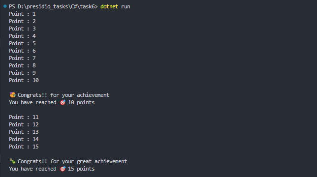

# Task 6: Delegates, Events, and Basic Event Handling


### 🎯Objective :

- Develop a console-based event-driven application where a counter triggers an event when it reaches a specific threshold, demonstrating the use of delegates and events in C#.


###  ✅  Requirements :

- Define a delegate and an event that fires when a counter reaches a target value.
- Create multiple event handlers that respond to the event.
- Implement a counter that increments in a loop and raises the event when it reaches the threshold.
- Showcase decoupling between event producers and consumers.


###  🛠 Implementation Steps


#### 1️⃣ Define a Delegate and an Event

- Created a delegate with return type.
- Created and event using the delegate.

```
public delegate void AchievementHandler(int points);

public event AchievementHandler? Achievement;

```

#### 2️⃣ Create an Event

- Maintain a count variable 
- If the count reaches a certain threshold raise the event.

```
public int Point
{ get; set; }


public void IncrementPoint()
{
    Point++;
    Console.WriteLine($"Point : {Point}");

    if (Point == 10 || Point == 15)
    {
        Achievement?.Invoke(Point);
    }
}
```

#### 3️⃣  Create Event Handlers and Subscribe to the Event

- Create Multiple eventhandlers.
- Subscribe to the event. So that when the event occurs event handlers will be notified

```
static void CelebrateFirst(int Point)
{
    Console.WriteLine("\n🥳 Congrats!! for your achievement");
}

static void CelebrateSecond(int Point)
{
    Console.WriteLine("\n🍾 Congrats!! for your great achievement");
}

static void Notify(int Point)
{
    Console.WriteLine($"You have reached 🎯 {Point} points\n");
}


Game game = new Game();
game.Achievement += CelebrateFirst;
game.Achievement += Notify;

```

#### 4️⃣ Trigger the Event

- Using loops trigger the event by incrementing the counter to reach the threshold value.

```
var count = 0;
while (count < 10)
{
    game.IncrementPoint();
    count++;
}
```

#### 5️⃣ Decoupling between Producers and Consumers

- Producers - Who raise the event
- Consumers - Who will handle the event
- As the Producers will only invoke the event, they doesn't know what fuctions will Consumer execute.
- So they can execute any functions at any given point of time by subscribing and unsubscribing to the event.
- Therfore, we got flexibility to decide and pass the function reference alone to the delegates to execute.

- In the below Example, till 10 ponits one function will be executed when event raises. After 10 points another function will be executed.

```
var count = 0;
while (count < 10)
{
    game.IncrementPoint();
    count++;
}

game.Achievement -= CelebrateFirst;
game.Achievement -= Notify;

game.Achievement += CelebrateSecond;
game.Achievement += Notify;


while (count < 15)
{
    game.IncrementPoint();
    count++;
}
```

### 📝 Code

```
using System;

namespace Task6
{
    class Game
    {
        public int Point
        { get; set; }

        public delegate void AchievementHandler(int points);

        public event AchievementHandler? Achievement;

        public void IncrementPoint()
        {
            Point++;
            Console.WriteLine($"Point : {Point}");

            if (Point == 10 || Point == 15)
            {
                Achievement?.Invoke(Point);
            }
        }
    }
    class Task
    {
        static void CelebrateFirst(int Point)
        {
            Console.WriteLine("\n🥳 Congrats!! for your achievement");
        }

        static void CelebrateSecond(int Point)
        {
            Console.WriteLine("\n🍾 Congrats!! for your great achievement");
        }

        static void Notify(int Point)
        {
            Console.WriteLine($"You have reached 🎯 {Point} points\n");
        }

        static void Main(string[] args)
        {
            Game game = new Game();
            game.Achievement += CelebrateFirst;
            game.Achievement += Notify;

            game.Point = 0;

            var count = 0;
            while (count < 10)
            {
                game.IncrementPoint();
                count++;
            }

            game.Achievement -= CelebrateFirst;
            game.Achievement -= Notify;

            game.Achievement += CelebrateSecond;
            game.Achievement += Notify;


            while (count < 15)
            {
                game.IncrementPoint();
                count++;
            }

        }
    }
}
```

### 📌 Output

