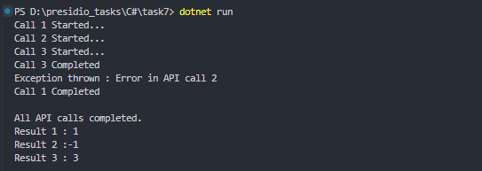

# Task 7: Asynchronous Programming and Multi-threading


### 🎯Objective :

- Develop a console application that demonstrates asynchronous programming and multi-threading by performing multiple tasks concurrently and handling exceptions gracefully.


###  ✅  Requirements :

- Use `async` and `await` to perform multiple tasks concurrently.
- Simulate fetching data from multiple sources using `Task.Delay`
- Aggregate and display the results once all tasks are complete.
- Implement exception handling to manage errors in asynchronous operations.


###  🛠 Implementation Steps


#### 1️⃣ Create Asynchronous Methods

- Create methods that simulate API Call using `Task.Delay()`

```
public static async Task<int> APICallOne()
{
    Console.WriteLine("Call 1 Started...");
    await Task.Delay(5000);
    Console.WriteLine("Call 1 Completed");
    return 1;
}
```

#### 2️⃣ Run Multiple Asynchronous Operations Concurrently

- Create a array of asynchronous operations and `await` it using `Task.WhenAll()` to wait till all async operations are completed

```
Task<int>[] tasks = {
    APICallOne(),
    APICallTwo(),
    APICallThree()
};

int[] results = await Task.WhenAll(tasks);
```

#### 3️⃣ Handle Exceptions in Asynchronous Operations

- Use `try-catch` block to handle exceptions thrown in asynchronous operations
```
public static async Task<int> APICallOne()
{
    try
    {
        Console.WriteLine("Call 1 Started...");
        await Task.Delay(5000);
        Console.WriteLine("Call 1 Completed");
        return 1;
    }
    catch (Exception ex)
    {
        Console.WriteLine($"Exception thrown : {ex.Message}");
        return -1;
    }
}
```

#### 4️⃣ Display Aggregated Results

- Display results from all the async functions when everything is completed.

```
int[] results = await Task.WhenAll(tasks);

Console.WriteLine($"All API calls completed.\nResult 1 : {results[0]}\nResult 2 :{results[1]}\nResult 3 : {results[2]}\n");
```

### 📝 Code

```
using System.Threading.Tasks;

namespace Task7
{
    class Tasks
    {
        public static async Task<int> APICallOne()
        {
            try
            {
                Console.WriteLine("Call 1 Started...");
                await Task.Delay(5000);
                Console.WriteLine("Call 1 Completed");
                return 1;
            }
            catch (Exception ex)
            {
                Console.WriteLine($"Exception thrown : {ex.Message}");
                return -1;
            }
        }

        public static async Task<int> APICallTwo()
        {
            try
            {
                Console.WriteLine("Call 2 Started...");
                await Task.Delay(5000);
                throw new Exception("Error in API call 2");
                Console.WriteLine("Call 2 Completed");
            }
            catch (Exception ex)
            {
                Console.WriteLine($"Exception thrown : {ex.Message}");
                return -1;
            }
        }

        public static async Task<int> APICallThree()
        {
            try
            {
                Console.WriteLine("Call 3 Started...");
                await Task.Delay(5000);
                Console.WriteLine("Call 3 Completed");
                return 3;
            }
            catch (Exception ex)
            {
                Console.WriteLine($"Exception thrown : {ex.Message}");
                return -1;
            }
        }


        static async Task Main(string[] args)
        {
            Task<int>[] tasks = {
                APICallOne(),
                APICallTwo(),
                APICallThree()
            };

            int[] results = await Task.WhenAll(tasks);

            Console.WriteLine($"All API calls completed.\nResult 1 : {results[0]}\nResult 2 :{results[1]}\nResult 3 : {results[2]}\n");
        }
    }
}
```

### 📌 Output

