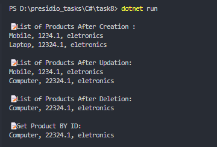

# Task 8: Generics and Interfaces with a Repository Pattern


### 🎯Objective :

- Develop a generic in-memory repository using interfaces and generics to perform CRUD operations efficiently.


###  ✅  Requirements :

- Implement a generic repository to manage data storage and retrieval.
- Define an interface `IRepository<T>` with common CRUD methods:
    - `Add(T intem)`
    - `Get(int id)`
    - `Update(int id, T item)`
    - `Delete(int id)`
- Create a generic class implementing the repository interface.
- Use type constraints while implementing (T : class).
- Implement a simple console UI for interacting with the repository.


###  🛠 Implementation Steps


#### 1️⃣ Define the Generic Repository Interface

- Declare a Generic Interface(`IRepository<T>`) with CRUD operations


```
public interface IRepository<T>
{
    List<T> GetAll();
    T? Get(int id);
    void Add(T item);
    void Update(int id, T item);
    void Delete(int id);
}
```

#### 2️⃣ Implement the Generic Repository Class

- Create a class Repository that implements the `IRepository<T>` interface
- Define all the functions from Interface like `Add`, `Get`, `Update` and `Delete`
- Create a list to store all the data in memory.

```
public class Repository<T> : IRepository<T> where T : class
{
    private readonly List<T> _items = new List<T>();

    public List<T> GetAll()
    {
        return _items;
    }

    public T? Get(int id)
    {
        return _items.ElementAtOrDefault(id);
    }

    public void Add(T item)
    {
        _items.Add(item);
    }

    public void Update(int id, T item)
    {
        if (id >= 0 && id <= _items.Count)
            _items[id] = item;
    }

    public void Delete(int id)
    {
        if (id >= 0 && id <= _items.Count)
            _items.RemoveAt(id);
    }

}
```

#### 3️⃣ Create a Sample Entity (Product)

- Define a sample model class `Product` with properties like `Name`, `Price` and `Type`

```
public class Product
{
    public Product(string name, float price, string type)
    {
        Name = name;
        Price = price;
        Type = type;
    }
    public string Name
    { get; set; }

    public float Price
    { get; set; }

    public string Type
    { get; set; }

}
```

#### 4️⃣ Instantiate the Repository and use it.

- Create instance for the repository
- Test all CRUD Operations.

```
Repository<Product> ProductRepo = new Repository<Product>(); // Product Repo Creation

Product product1 = new Product("Mobile", 1234.1f, "eletronics");
ProductRepo.Add(product1); //Create 

List<Product> products = ProductRepo.GetAll(); //Read

Product updateProduct = new Product("Computer", 22324.1f, "eletronics");
ProductRepo.Update(1, updateProduct); //Update

ProductRepo.Delete(0); //Delete
```

### 📝 Code

```
using task8;
using task8.Class;

namespace Task8
{
    class Task
    {
        static void Main(string[] args)
        {
            Repository<Product> ProductRepo = new Repository<Product>(); // Product Repo Creation
            Repository<User> UserRepo = new Repository<User>(); //User Repo Creation

            Product product1 = new Product("Mobile", 1234.1f, "eletronics");
            Product product2 = new Product("Laptop", 12324.1f, "eletronics");


            ProductRepo.Add(product1); //Create 
            ProductRepo.Add(product2);


            List<Product> products = ProductRepo.GetAll(); //Read
            Console.WriteLine("\n📝List of Products After Creation : ");
            foreach (var p in products)
            {
                Console.WriteLine($"{p.Name}, {p.Price}, {p.Type} ");
            }

            Product updateProduct = new Product("Computer", 22324.1f, "eletronics");

            ProductRepo.Update(1, updateProduct); //Update

            products = ProductRepo.GetAll(); //Read
            Console.WriteLine("\n📝List of Products After Updation: ");
            foreach (var p in products)
            {
                Console.WriteLine($"{p.Name}, {p.Price}, {p.Type} ");
            }

            ProductRepo.Delete(0); //Delete

            products = ProductRepo.GetAll(); //Read
            Console.WriteLine("\n📝List of Products After Deletion: ");
            foreach (var p in products)
            {
                Console.WriteLine($"{p.Name}, {p.Price}, {p.Type} ");
            }

            Product? product = ProductRepo.Get(0); //Read By ID
            Console.WriteLine("\n📝Get Product BY ID: ");

            if (product != null)
                Console.WriteLine($"{product.Name}, {product.Price}, {product.Type} \n");
            else
                Console.WriteLine("OOPS!!Product not found.\n");

        }
    }
}
```

### 📌 Output

