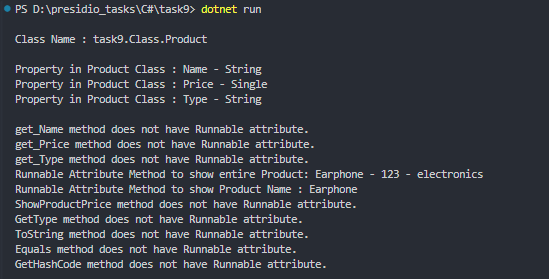

# Task 9: Reflection and Custom Attributes


### 🎯Objective :

- Develop an application that dynamically discovers and executes methods based on custom attributes using reflection.


###  ✅  Requirements :

- Define a custom attribute`[Runnable]`.
- Create classes with multiple methods decorated with [Runnable]
- Use reflection to scan the assembly and find methods marked with this attribute.
- Dynamically invoke the discovered methods and display their outputs.


###  🛠 Implementation Steps


#### 1️⃣ Define a Custom Attribute

- Create a custom attribute class (`RunnableAttribute`).

```
[AttributeUsage(AttributeTargets.Class | AttributeTargets.Method, AllowMultiple = false)]
public class RunnableAttribute : System.Attribute
{}
```

#### 2️⃣ Create Sample Classes with Marked Methods

- Define methods in the class and add `[Runnable]` attribute to them.

```
[Runnable]
public class Product
{
    public Product(string name, float price, string type)
    {
        Name = name;
        Price = price;
        Type = type;
    }
    public string Name
    { get; }

    public float Price
    { get; }

    public string Type
    { get; }

    [Runnable]
    public void ShowProduct()
    {
        Console.WriteLine($"Runnable Attribute Method to show entire Product: {Name} - {Price} - {Type}");
    }

    [Runnable]
    public void ShowProductName()
    {
        Console.WriteLine($"Runnable Attribute Method to show Product Name : {Name}");
    }

    public void ShowProductPrice()
    {
        Console.WriteLine($"Non-Runnable Method to show Product Price : {Price}");
    }

}
```

#### 3️⃣ Use Reflection to Discover Methods

- Scan the assembly for methods marked with [Runnable].

```
//Reflection class to get Type of the Class given
Type type = typeof(Product); 

//Activator class to instantiate object dynamically
Product? obj = (Product?)Activator.CreateInstance(type, "Earphone", 123.0f, "electronics"); 

foreach (var method in type.GetMethods())
{
    if (method.GetCustomAttribute<RunnableAttribute>() != null)
    {
        method.Invoke(obj, null);
    }
    else
    {
        Console.WriteLine($"{method.Name} method does not have Runnable attribute.");
    }
}

```

#### 4️⃣ Invoke the Discovered Methods


- Execute the marked methods dynamically and display their results.

```
foreach (var method in type.GetMethods())
{
    if (method.GetCustomAttribute<RunnableAttribute>() != null)
    {
        method.Invoke(obj, null);
    }
    else
    {
        Console.WriteLine($"{method.Name} method does not have Runnable attribute.");
    }
}
```

### 📝 Code

```

using System.Reflection;
using task9.Attribute;
using task9.Class;

namespace Task9
{
    class Tasks
    {
        static void Main(string[] args)
        {
            Type type = typeof(Product); //Reflection class to get Type of the Class given

            Console.WriteLine("\nClass Name : " + type.FullName);

            Product? obj = (Product?)Activator.CreateInstance(type, "Earphone", 123.0f, "electronics"); //Activator class to instantiate object dynamically
           
            Console.WriteLine();
            foreach (var prop in type.GetProperties())
            {
                Console.WriteLine($"Property in Product Class : {prop.Name} - {prop.PropertyType.Name}");
            }
            Console.WriteLine();

            foreach (var method in type.GetMethods())
            {
                if (method.GetCustomAttribute<RunnableAttribute>() != null)
                {
                    method.Invoke(obj, null);
                }
                else
                {
                    Console.WriteLine($"{method.Name} method does not have Runnable attribute.");
                }
            }
            Console.WriteLine();
        }
    }
}
```

### 📌 Output

